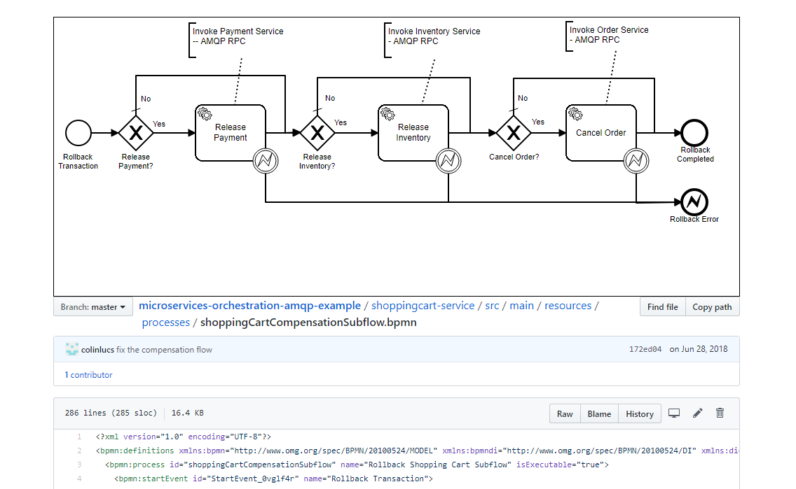

# BpmnViewer

TamperMonkey script to show BPMN source file as diagram.

Available on [openuserjs.org](https://openuserjs.org/scripts/ludoo0d0a/Bpmn_Viewer)

Then try it on a [bpmn raw file](https://github.com/colinlucs/microservices-orchestration-amqp-example/blob/master/shoppingcart-service/src/main/resources/processes/shoppingCartCompensationSubflow.bpmn)

